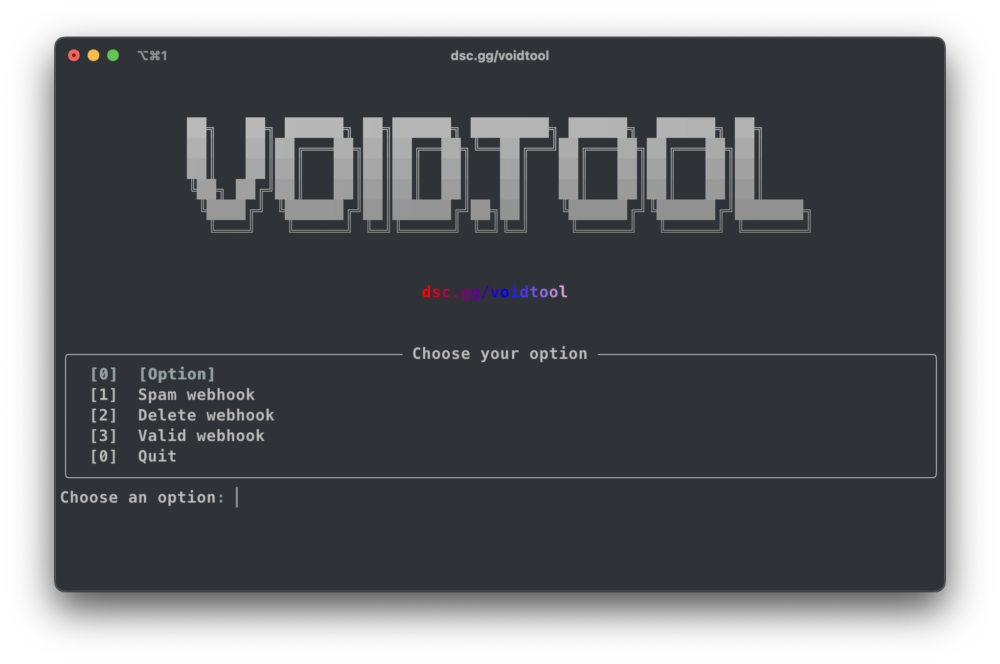

# void.tool

**void.tool** is a simple and powerful command-line utility for working with Discord.

> ⚠️ This tool violates Discord's ToS.

---



## ✨ Features

- 🔍 **Validate Webhook**  
  Quickly check if a Discord webhook URL is valid and active.

- 🚀 **Spam Webhook**  
  Send multiple messages to a webhook with custom content.

- ❌ **Delete Webhook**  
  Instantly delete a webhook from the server.
  
- (more features in the future!)

---

## 📦 Installation

```bash
git clone https://github.com/wihqwss/void-tool.git
cd void.tool
uv sync
uv run main.py
```
> You need **git**, **uv** and **python** installed.

## ✍️Credits to:
@wihqwss for void.tool
@aiko-chan-ai for bot client